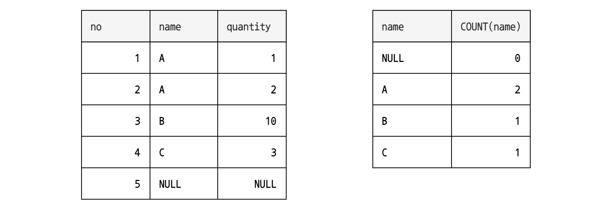

# 5장 집계와 서브쿼리 

> SQL = 데이터베이스라 불리는 '데이터 집합'
>
> 집합의 개수나 합계가 궁금하다면 SQL이 제공하는 **집계함수** 사용

#


### # 집계함수(= 집합 함수)

- 인수로 집합 지정
- 집합을 특정 방법으로 계산하여 그 결과 반환
- 복수의 값(집합)에서 하나의 값 계산하여 그 결과 반환 

<br/>

--- 

## # COUNT로 행 개수 구하기

> COUNT 함수 : 인수로 주어진 집합의 '개수' 반환

- 인수로 지정된 집합의 개수 계산 
- `COUNT(*)` → 모든 열 = 테이블 전체 
- WHERE 구의 조건에 맞는 행의 개수를 구할 수 있다. 

#  

#### # 집계함수와 NULL 값

> 집합 안에 NULL 값 있을 경우 무시!

```sql
SELECT COUNT(no), COUNT(name) FROM sample;
```


#### # DISTINCT 중복 제거

> DISTINCT 열명 으로 해당 열의 중복된 데이터 제거

```sql
SELECT DISTINCT name FROM sample;
```


##### → 중복하지 않은 데이터의 개수를 구하고 싶을때 ?

- WHERE 구에서는 검색할 조건을 지정하는 것 밖에 할 수 없기 때문에 **'할 수 없다'** 

- `COUNT(DISTINCT name)` : 집계함수의 인수로 DISTICNT을 사용한 수식을 지정

  

→ **`COUNT(*)` 과 `COUNT(1)` 의 차이점 ?**

- 두 명령문 모두 동일한 방식이며, NON NULL 로 NULL 상관없이 모든 행 수 카운트


→ **COUNT 기능의 사용법 ?**

- **`COUNT (*)` –** 이것은 SELECT QUERY에서 반환 된 모든 행을 COUNT 
- **`COUNT (표현식)` –** 이것은 표현식에 대한 모든 NON NULL 값을 COUNT
- **`COUNT (DISTINCT 표현식)` –** 이것은 표현식에 대해 모든 NON NULL 및 UNIQUE 값을 COUNT


<br/>


## # 합계, 평균 구하기

```sql
SUM([ALL|DISTINCT] 집합) -- 합계
AVG([ALL|DISTINCT] 집합) -- 평균
MIN([ALL|DISTINCT] 집합) -- 최솟값
MAX([ALL|DISTINCT] 집합) -- 최댓값
```


<br/>


## # 그룹화로 집계

```sql
SELECT * FROM 테이블명 GROUP BY 열1, 열2, ...
```

- **지정된 열의 값이 같은 행이 하나의 그룹으로 묶인다.**
- DISTINCT 와 같이 중복을 제거하는 효과


→ **DISTINCT 로 중복 제거 vs. GROUP BY 로 그룹화 ?**

- GROUP BY 구를 지정하는 경우, 거의 집계함수와 함께 사용
  - GROUP BY 구로 그룹화된 각각의 그룹이 하나의 집합으로서 집계함수의 인수로 넘겨지기 때문


```sql 
SELECT name, COUNT(name) FROM sample GROUP BY name;
SELECT name, COUNT(name) FROM sample GROUP BY 1;
```



# 


#### # HAVING 구로 조건 지정

> SELECT 명령에는 HAVING 구를 사용하여 조건 지정 

- WHERE 구로 행을 검색하는 처리 GROUP BY 로 그룹화하는 처리보다 순서상 앞서기 때문에,
  - _WHERE 구 → GROUP BY 구 → HAVING 구  → SELECT 구 → ORDER BY 구_
- 그룹화가 필요한 **집계함수는 WHERE 구에서 지정할 수** ❌
- HAVING 구를 사용하면 집계함수를 사용해서 조건식을 지정할 수 ⭕️
- `HAVING 구` 는 `GROUP BY 구`  의 뒤에 기술하며, `WHERE 구` 와 동일하게 조건식 지정
- 조건식에는 그룹별로 집계 된 열의 값이나 집계함수의 계산 결과가 전달
- ORDER BY 구는 그룹화보다 나중에 처리 → `ORDER BY COUNT(name)`


```sql 
SELECT name, COUNT(name) FROM sample GROUP BY name HAVING COUNT(name) = 1;
```


→ **GROUP BY를 사용할 때 주의할 점 !**

- GROUP BY 에서 지정한 열이외의 열은 집계함수를 사용하지 않은 채 SELECT 구에 지정할 수 앖다.

```sql
SELECT no, name, quantity FROM sample GROUP BY name; -- 에러 
SELECT MIN(no), name, SUM(quantity) FROM sample GROUP BY name; 
```


<br/>


## # 서브쿼리

> SELECT 명령에 의한 데이터 질의로, 상부가 아닌 하부의 부수적인 질의 

- 서브쿼리는 SQL 명령문 안에 지정하는 하부 SELECT 명령
- 서브쿼리를 사용하여 DELETE 명령과 SELECT 명령을 결합할 수 ⭕️
- 스칼라 서브쿼리는 사용하기 쉬운 서브쿼리 

#  

#### # DELETE의 WHERE 구에서 서브쿼리

> SELECT 명령을 DELETE 명령의 WHERE 구에서 사용하여 원하는 행을 삭제할 수 있다.

```sql
DELETE FROM sample WHERE a = (SELECT MIN(a) FROM sample);

-- 변수 사용
SET @a = (SELECT MIN(a) FROM sample);
DELETE FROM sample WHERE a = @a;
```

- MySQL 에서는 에러 발생 → **데이터를 추가하거나 갱신할 경우 동일한 테이블을 서브쿼리에서 사용할 수 ❌**
  - 인라인 뷰로 임시 테이블을 만들어서 처리,,,


#### # 스칼라 값

> SELECT 명령이 하나의 값만 반환하는 것 = ''스칼라 값을 반환한다'' 의미

- 서브쿼리의 패턴

  - ```sql
    -- 하나의 값을 반환하는 패턴
    SELECT MIN(a) FROM sample;
    
    -- 복수의 행이 반환되지만 열은 하나인 패턴
    SELECT no FROM sample;
    
    -- 하나의 행이 반환되지만 열이 복수인 패턴
    SELECT MIN(no), MAX(no) FROM sample;
    
    -- 복수의 행, 복수의 열이 반환되는 패턴
    SELECT no, a FROM sample;
    ```

- 서브쿼리로서 사용하기 쉽기 때문에 **스칼라 값(단일 값)만 반환하는 SELECT 명령** 특별 취급
- 특정한 두 가지가 서로 동일한지 여부를 비교할 때 서로 단일 값으로 비교
  - WHERE 구에서 스칼라 값을 반환하는 서브쿼리는 `=` 연산자로 비교할 수 있다


#### #  SELECT 구, SET 구에서 서브쿼리 사용하기

> SELECT 구, SET 구에서 서브쿼리를 지정할 때는 스칼라 서브쿼리 필요

```sql
-- in SELECT 구
SELECT 																	-- 상부의 SELECT 명령에는 FROM 구 없음
	(SELECT COUNT(*) FROM sample) AS sq1,
	(SELECT COUNT(*) FROM sample) AS sq2; 
	
-- in SET 구
UPDATE sample SET a = (SELECT MAX(a) FROM sample);
```


#### # FROM 구에서 서브쿼리 사용하기

> FROM 구에서 테이블 이외 서브쿼리도 지정할 수 있다. (스칼라 서브쿼리일 필요 ❌)

- SELECT 명령 안에 SELECT 명령이 (= 네스티드 구조, 중첩구조, 내포구조)
- FROM 구에서는 테이블이나 서브쿼리에 별명을 붙일 수 ⭕️ (AS 사용)
- 중첩구조는 몇 단계로든 구성 가능

```sql
SELECT * FROM (SELECT * FROM sample) AS sq;
```


#### # INSERT 명령과 서브쿼리 

> 1. VALUES 구의 값으로 서브쿼리 사용
> 2. VALUES 구 대신 SELECT 명령 사용 


1. **VALUES 구의 값으로 서브쿼리 사용** 

   - 서브쿼리는 스칼라 서브쿼리로 지정 필요, 자료형 일치해야 함.

   - ```sql
     INSERT INTO sample VALUES (
     	(SELECT COUNT(*) FROM sample1),
       (SELECT COUNT(*) FROM sample2)
     );
     ```

2. **VALUES 구 대신 SELECT 명령을 사용**

   - SELECT 가 반환하는 열 수와 자료형이 INSERT할 테이블과 일치해야 함.
   - SELECT 명령의 결과를 INSERT INTO 로 지정한 테이블에 전부 추가
   - 데이터의 복사나 이동을 할 때 자주 사용

   - ```sql
     INSERT INTO sample SELECT 1, 2;
     ```


<br/>


## # EXIST 술어와 상관 서브쿼리 

> 상관 서브쿼리를 EXISTS 술어로 조합시켜 서브쿼리 사용 

```sql
EXISTS (SELECT 명령)
```

- 서브쿼리가 반환하는 결과값이 있는지 확인 가능 
- 반환된 행이 있는지를 확인해보고 값이 있으면 참, 없으면 거짓을 반환


#### #  EXISTS

> EXISTS 술어를 사용하여 '데이터가 존재하는지 아닌지' 판별 가능

```sql
UPDATE sample1 SET a = '있음' WHERE
	EXISTS (SELECT * FROM sample2 WHERE no2 = no); -- 218p
```

- EXISTS 술어에 서브쿼리를 지정하면 서브쿼리가 행을 반환할 경우 참 반환


#### #  NOT EXISTS

> '없음'의 경우 행이 존재하지 않는 상태가 참 

```sql
UPDATE sample1 SET a = '없음' WHERE
	NOT EXISTS (SELECT * FROM sample2 WHERE no2 = no); -- 218p
```


#### #  상관 서브쿼리

> 부모 명령과 자식인 서브쿼리가 특정 관계를 맺는 것

- ex) 자식인 서브쿼리에서 sample2 테이블의 no2 열 값이 부모의 no 열 값과 일치하는 행
- 부모 명령과 연관지어 처리되기 때문에 서브쿼리 부분만 따로 실행시킬 수 ❌
- 만약, no2 = no 이 아닌 no = no 처럼 **연관된 열명이 같은 이름을 가진다면**
  - 해당 열이 어느 테이블의 것인지 명시!! `sample1.no` , `sample2.no2`


#### # IN

> 집합 안의 값이 존재하는 지 확인 가능

```sql
열명 IN (집합)	
```

- 특정 열의 값이 '**무엇 또는 (OR) 무엇**' 이라는 조건식 지정하는 경우 **IN 사용**
- 오른쪽에 집합 지정, 왼쪽에 지정된 값과 같은 값이 집합 안에 있으면 참 반환
- 집합은 상수 리스트를 괄호로 묶어 기술
- 서브쿼리를 사용할 때 스칼라 서브쿼리일 필요 ❌
- ↔️ `NOT IN`

```sql
SELECT * FROM sample1 WHERE no IN (3, 5);
SELECT * FROM sample1 WHERE no IN
	(SELECT no2 FROM sample2);
```


##### # 집합 안에 NULL 이 있으면?

- **IN** 에서는 집합 안에 NULL 값이 있을 경우 제대로 계산할 수 없음 → NULL 값 비교는 `IS NULL`  사용

- **NOT IN** 의 경우, 집합 안에 NULL 값이 있으면 집합 안에 포함되어 있지 않아도 참 반환 ❌ → UNKNOWN

- #  

- MySQL에서는 집합에 NULL 이 포함되어 있는 경우, 왼쪽 값이 집합에 포함되어 있으면 참 아니면 NULL 반환

- NOT IN의 경우 집합에 NULL이 포함되어 있다면 그 결과값은 0

- NULL을 반환한다는 것 = 비교할 수 없다는 것

  - NULL 인 경우 왼쪽의 값, 오른쪽의 값 관계없이 **비교할 수 없으므로** 조건식은 NULL 반환 